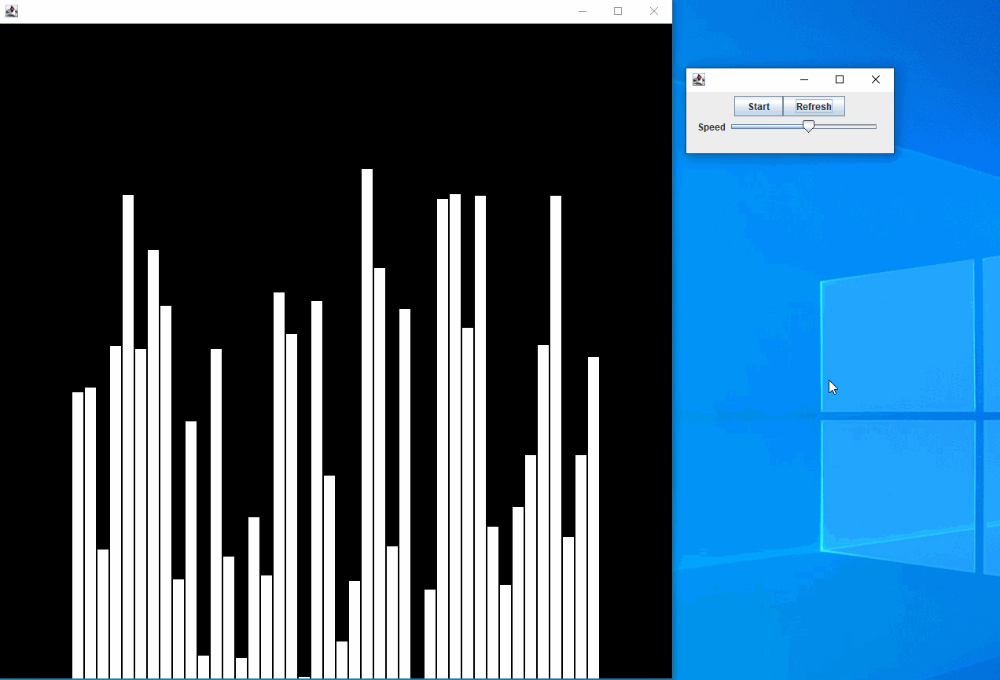

# Quicksort
A showcase of the Quicksort algorithm in Java

Code that implements the iconic Quicksort algorithm on a randomized array and visualizes execution step-by-step.

Provides an option pane to tune values.
